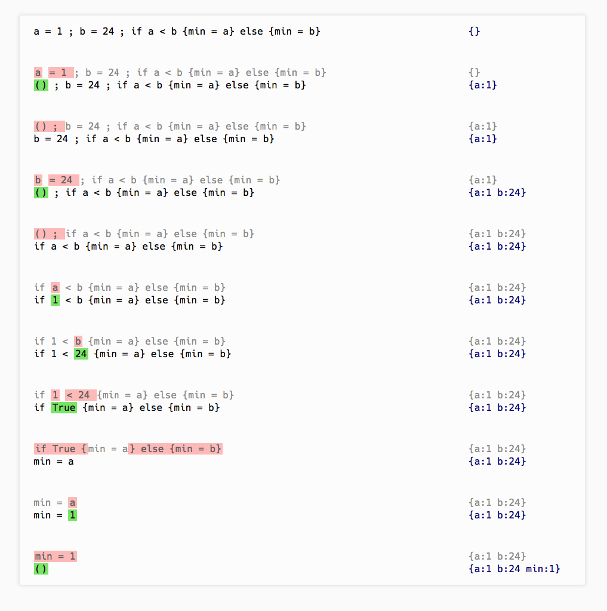

# small-step

Step-by-step vizualization of execution in Small-Step semantics.

## dependencies

- `ghci` with `Prelude` and `runhaskell` in `$PATH`

## test

`runhaskell Tests.hs`

## run

- `runhaskell Main factorial` 

- open `page.html`

To custom programs: write their definition in `Tests.hs`, list them in `Main.hs`, `program`

